# Reliable UDP File Transfer

**UDP 위에 신뢰성 있는 파일 전송 프로토콜을 직접 설계하고 구현한 프로젝트입니다.**
Go-Back-N Sliding Window ARQ를 C 소켓으로 구현해, 패킷이 유실되는 환경에서도 원본과 동일한 파일이 전달되도록 만들었습니다.

윈도우 크기를 1에서 32까지 늘려가며 측정한 결과, **처리량이 5.83 MB/s → 29.74 MB/s로 약 5배 향상**되었습니다.

<br>

## 왜 만들었는가

TCP는 `send()` 한 줄이면 알아서 재전송하고 순서를 맞춰줍니다. 그런데 그 "알아서"의 내부가 궁금했습니다.
그래서 **아무 보장이 없는 UDP를 바닥에 깔고, TCP가 해주던 것들을 직접 만들어보기로** 했습니다.

UDP가 주지 않는 것은 세 가지입니다.

1. **도착 보장이 없다** → 패킷이 사라져도 아무도 알려주지 않음
2. **순서 보장이 없다** → 3번이 2번보다 먼저 올 수 있음
3. **중복 제거가 없다** → 같은 패킷이 두 번 올 수 있음

이 세 가지를 Sequence Number · ACK · Timeout 재전송으로 직접 메우는 것이 목표였습니다.

<br>

## 기술 스택

| 구분 | 내용 |
|---|---|
| 언어 | C |
| 네트워크 | UDP (`SOCK_DGRAM`), BSD Socket API |
| I/O 다중화 | `select()` |
| 빌드 | GNU Make, gcc (`-Wall -Wextra -O2`) |
| 환경 | Linux (Ubuntu / WSL) |

<br>

## 프로토콜 설계

### 패킷 구조

헤더 12바이트 + 데이터 최대 1024바이트로 구성했습니다.

```c
#pragma pack(push, 1)
typedef struct {
    int  type;              // TYPE_DATA(1) | TYPE_ACK(2) | TYPE_FIN(3)
    int  seq;               // 시퀀스 번호
    int  size;              // 실제 데이터 길이
    char data[DATA_SIZE];   // 1024 bytes
} Packet;
#pragma pack(pop)
```

설계에서 신경 쓴 부분이 세 가지 있습니다.

- **`#pragma pack(1)`** — 컴파일러가 넣는 패딩 때문에 송신·수신 측 구조체 크기가 어긋나면 파싱이 통째로 깨집니다. 패딩을 제거해 바이트 배치를 고정했습니다.
- **`htonl()` / `ntohl()`** — 헤더의 모든 정수 필드를 네트워크 바이트 오더로 변환합니다. 엔디안이 다른 기기끼리도 같은 값으로 읽힙니다.
- **가변 길이 전송** — 항상 구조체 전체(1036바이트)를 보내지 않고 `HEADER_SIZE + 실제 데이터 크기`만 보냅니다. 마지막 조각처럼 데이터가 적은 패킷에서 불필요한 대역폭을 쓰지 않습니다.

### 전송 흐름

```
Sender                                  Receiver
  │                                        │
  ├── DATA(seq=0..7) ─────────────────────►│  윈도우 크기만큼 연속 전송
  │                                        │
  │◄────────────────────── ACK(seq) ───────┤  순서 일치 패킷만 승인
  │                                        │
  ├── (타임아웃) GBN 재전송 base..next_seq ►│  순서 불일치 패킷은 폐기 + 직전 ACK 재전송
  │                                        │
  ├── FIN ────────────────────────────────►│
  │◄────────────────────── FIN_ACK ────────┤  파일 close, 다음 전송 대기
```

<br>

## 핵심 구현

### 1. Go-Back-N 슬라이딩 윈도우 (송신측)

`base`(가장 오래된 미확인 패킷)와 `next_seq`(다음 보낼 패킷) 두 포인터로 윈도우를 관리합니다.
ACK을 기다리지 않고 **윈도우 크기만큼 먼저 쏟아붓기 때문에**, 매번 왕복을 기다리는 Stop-and-Wait보다 훨씬 빠릅니다.

```c
while (next_seq < base + WINDOW_SIZE && next_seq < total_packets) {
    int p_size = HEADER_SIZE + ntohl(packet_buffer[next_seq].size);
    sendto(sock, &packet_buffer[next_seq], p_size, 0, ...);
    if (!timer_running) { timer_start = get_current_time_ms(); timer_running = 1; }
    next_seq++;
}
```

전송할 파일은 시작 시 한 번에 읽어 `Packet` 배열로 메모리에 올려둡니다. 재전송할 때 파일을 다시 `fseek` 할 필요가 없습니다.

> **`WINDOW_SIZE = 1`로 두면 그대로 Stop-and-Wait ARQ가 됩니다.** 성능 비교 실험에서 이 값을 바꿔가며 측정했습니다.

### 2. 폴링 없이 기다리는 동적 타임아웃

가장 신경 쓴 부분입니다. 타임아웃을 확인하려고 CPU를 태우며 계속 도는 대신, **`select()`에 "남은 시간"만큼만 대기 시간을 걸어** 두 가지를 동시에 처리했습니다.

```c
long long elapsed   = get_current_time_ms() - timer_start;
long long remaining = TIMEOUT_MS - elapsed;
if (remaining < 0) remaining = 0;

tv.tv_sec  = remaining / 1000;
tv.tv_usec = (remaining % 1000) * 1000;

int select_result = select(sock + 1, &reads, NULL, NULL, &tv);
```

- ACK이 먼저 오면 → `select`가 즉시 깨어나 윈도우를 슬라이딩
- 타임아웃까지 아무것도 안 오면 → 정확히 그 시점에 깨어나 재전송

GBN 표준대로 **타이머는 윈도우 전체에 하나만** 둡니다. ACK을 받아 `base`가 전진하면 타이머를 갱신하고, `base == next_seq`(전부 확인됨)이면 타이머를 멈춥니다.

### 3. 누적 ACK과 순서 검증 (수신측)

수신측은 `expected_seq` 하나만 들고 있습니다. 버퍼가 필요 없어 메모리를 거의 쓰지 않는 것이 GBN의 장점입니다.

```c
if (p_seq == expected_seq) {
    fwrite(packet.data, 1, p_size, fp);
    /* ACK(p_seq) 전송 */
    expected_seq++;
} else {
    /* 순서 불일치 → 폐기하고 마지막 성공 ACK을 재전송해 누적 ACK 유도 */
    if (expected_seq > 0) { /* ACK(expected_seq - 1) 전송 */ }
}
```

기대하지 않은 번호가 오면 **버리고 직전 ACK을 다시 보냅니다.** 중복 패킷이 도착해도 파일에 두 번 쓰이지 않으므로, 중복 제거와 순서 보장이 이 한 줄의 규칙으로 함께 해결됩니다.

### 4. 무한 대기 방어

신뢰성 프로토콜에서 가장 위험한 상황은 **상대가 죽었는데 영원히 기다리는 것**입니다. 두 군데에 상한을 걸었습니다.

- **데이터 구간** — 진전 없는 타임아웃이 연속 5회 발생하면 서버 다운으로 판단하고 안전 종료 (`data_retries`). ACK을 받아 `base`가 전진하면 카운터를 0으로 초기화하므로, 느린 회선에서 오탐하지 않습니다.
- **종료 구간** — `FIN`은 최대 5회까지 재전송하며 `FIN_ACK`을 기다립니다. 마지막 ACK이 유실되어도 전송이 매달리지 않습니다.

### 5. 패킷 유실 시뮬레이션

실제 LAN에서는 유실이 거의 나지 않아 복구 로직을 검증할 수 없었습니다. 그래서 **수신측에 확률적 유실기를 넣어** 원하는 유실률을 만들어냈습니다.

```c
#define LOSS_RATE 0   // 실험 시 10, 20 ... 으로 조정

if (rand() % 100 < LOSS_RATE) {
    printf("[LOSS ] 의도적 패킷 유실 작동 ➔ SEQ:%d 드롭함\n", p_seq);
    continue;         // ACK도 보내지 않음 → 송신측 타임아웃 유도
}
```

<br>

## Go-Back-N 복구 동작 예시

윈도우 크기 4에서 2번 패킷이 유실됐을 때의 실제 흐름입니다.

| 단계 | Sender | Receiver |
|---|---|---|
| 1 | `0`, `1` 전송 | 순서 일치 → `ACK 0`, `ACK 1` |
| 2 | `2` 전송 | **유실** (도착하지 않음) |
| 3 | `3`, `4` 전송 | 기대값은 2 → 폐기하고 `ACK 1` 재전송 |
| 4 | `ACK 1` 이후 진전 없음 → **타임아웃** | |
| 5 | `2`, `3`, `4` **전부 재전송** (Go-Back-N) | |
| 6 | | 순서대로 수신 → `ACK 2`, `ACK 3`, `ACK 4` |

이름 그대로 **틀린 지점까지 되돌아가(Go Back) 그 뒤를 전부 다시 보냅니다.** 구현이 단순하고 수신 버퍼가 필요 없는 대신, 유실 하나에 여러 패킷을 다시 보내는 비용을 감수하는 구조입니다.

<br>

## 성능 실험

### 실험 환경

| 항목 | 값 |
|---|---|
| OS | Ubuntu (WSL) |
| 파일 크기 | 10 MB |
| DATA_SIZE | 1024 Byte |
| 측정 방법 | 각 WINDOW_SIZE마다 3회 반복 후 평균 |

### 결과

| WINDOW_SIZE | 평균 전송 시간 (s) | Throughput (MB/s) |
|---:|---:|---:|
| 1 (Stop-and-Wait) | 1.635 | 5.83 |
| 2 | 1.150 | 8.35 |
| 4 | 0.624 | 15.45 |
| 8 | 0.484 | 19.96 |
| 16 | 0.461 | 20.95 |
| 32 | **0.338** | **29.74** |

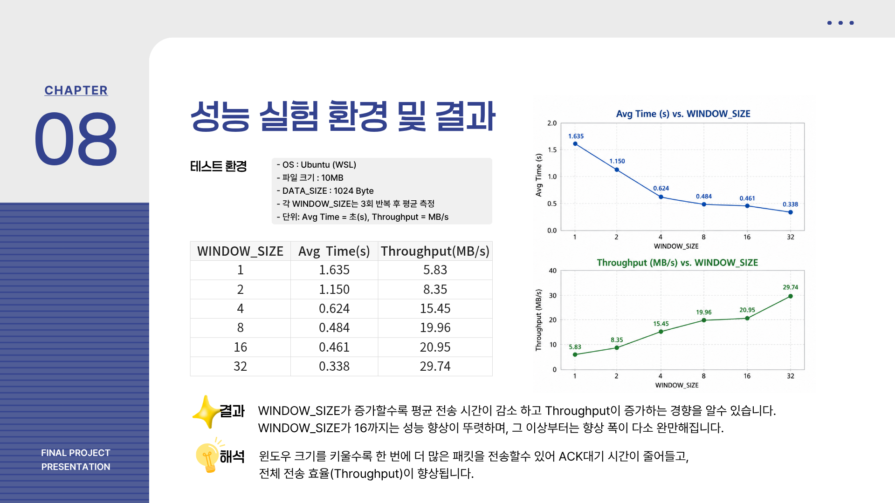

**해석 —** 윈도우를 키울수록 ACK을 기다리며 노는 시간이 줄어 처리량이 올라갑니다.
다만 **1 → 8 구간에서 개선 폭이 가장 크고, 16 이후로는 완만해집니다.** 링크가 이미 포화되어 윈도우를 더 늘려도 남는 여유가 크지 않기 때문입니다. Stop-and-Wait 대비 최종 성능은 약 5배입니다.

### 무결성 검증

성능만 좋고 파일이 깨지면 의미가 없으므로, 전송 후 매번 원본과 수신본을 비교했습니다.

```bash
diff test.txt received_backend.bin && echo "무결성 검증 통과"
```

<br>

## 실행 방법

```bash
# 1. 빌드
make

# 2. 수신 서버 실행 (터미널 1)
./serv 9190

# 3. 파일 전송 (터미널 2)
./cli 127.0.0.1 9190 test.txt

# 4. 무결성 확인
diff test.txt received_backend.bin
```

전송이 끝나면 송신측이 성능 리포트를 출력합니다.

```
=============================================
[최종 성능 평가 리포트]
 설정된 윈도우 크기 (WINDOW_SIZE) : 8
 전송된 파일 크기 (File Size)    : 10.00 MB
 총 소요 시간 (Total Time)       : 0.484 초
 총 패킷 재전송 횟수 (Resends)   : 0 회
 시스템 처리량 (Throughput)      : 19.96 MB/s
=============================================
```

**설정 변경**

| 상수 | 위치 | 의미 |
|---|---|---|
| `WINDOW_SIZE` | `file_transfercli.c` | 슬라이딩 윈도우 크기 (1이면 Stop-and-Wait) |
| `TIMEOUT_MS` | `file_transfercli.c` | 재전송 타임아웃 (기본 1000ms) |
| `LOSS_RATE` | `file_transferserv.c` | 의도적 패킷 유실률 (%) |
| `DATA_SIZE` | `file_transfer.h` | 패킷당 데이터 크기 (기본 1024B) |

<br>

## 프로젝트 구조

```
.
├── file_transfer.h        # 공통 헤더 — 패킷 구조체, 타입 상수
├── file_transferserv.c    # 수신측 — 누적 ACK, 순서 검증, 유실 시뮬레이션
├── file_transfercli.c     # 송신측 — GBN 슬라이딩 윈도우, 타임아웃 재전송
├── Makefile
├── images/                # 발표 자료 슬라이드
└── network_project.pdf    # 설계·실험 발표 자료
```

<br>

## 한계와 개선 방향

구현하면서 확인한, 현재 코드가 감당하지 못하는 지점들입니다.

- **높은 유실률에서 재전송 비용이 과합니다.** GBN은 패킷 하나가 사라져도 그 뒤 전부를 다시 보냅니다. 유실된 패킷만 골라 복구하는 **Selective Repeat**이나 TCP의 **Fast Retransmit(중복 ACK 3회)** 을 적용하면 유실 환경에서 대역폭을 지킬 수 있을 것으로 보입니다.
- **타임아웃이 1초 고정입니다.** TCP처럼 RTT를 측정해 동적으로 조정(RTO)하면 빠른 링크에서 복구가 더 빨라집니다.
- **동시에 한 클라이언트만 처리합니다.** 수신측이 `expected_seq` 하나만 들고 있어 클라이언트별 상태 분리가 없습니다. 주소 기준 세션 테이블이 필요합니다.
- **혼잡 제어가 없습니다.** 윈도우 크기가 상수로 고정되어 있어, 네트워크 상황에 따라 조절하는 슬로우 스타트·혼잡 회피는 구현 범위에 넣지 않았습니다.

<br>

## 배운 점

- **`send()` 한 줄 뒤에 무엇이 있는지 알게 됐습니다.** 시퀀스 번호, 누적 ACK, 타이머, 재전송, 연결 종료 핸드셰이크까지 직접 만들어보니 TCP가 대신 해주던 일의 양이 실감났습니다.
- **신뢰성과 성능은 맞바꾸는 관계입니다.** 안전하게 하나씩 확인하며 보내면 5.83 MB/s, 위험을 감수하고 몰아 보내면 29.74 MB/s였습니다. 어디까지 몰아붙일지 정하는 것이 곧 윈도우 크기 설계였습니다.
- **"동작한다"는 측정하기 전까지는 추측입니다.** 유실률을 인위적으로 만들어 복구 로직을 강제로 발동시키고, `diff`로 매번 무결성을 확인하고 나서야 구현을 신뢰할 수 있었습니다.

<br>

## 발표 자료

설계 과정과 실험 결과 전체는 아래 자료에 정리되어 있습니다.

📄 **[발표 자료 전체 보기 (PDF)](./network_project.pdf)**

<details>
<summary>슬라이드 미리보기</summary>

<br>

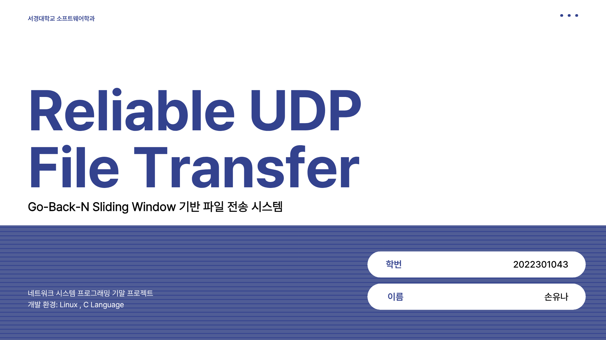
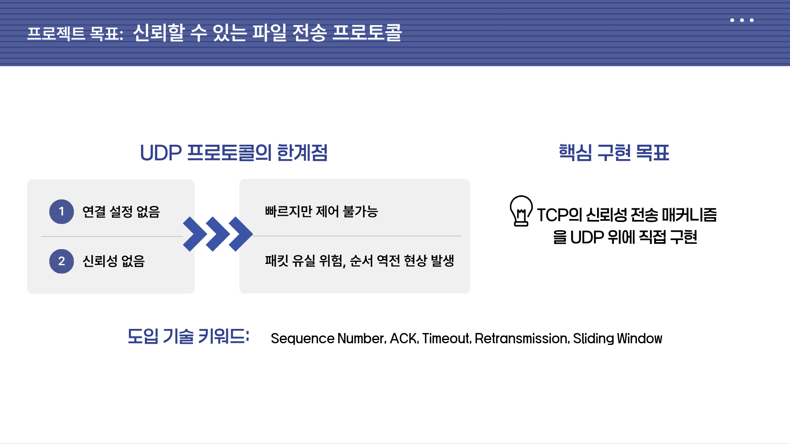
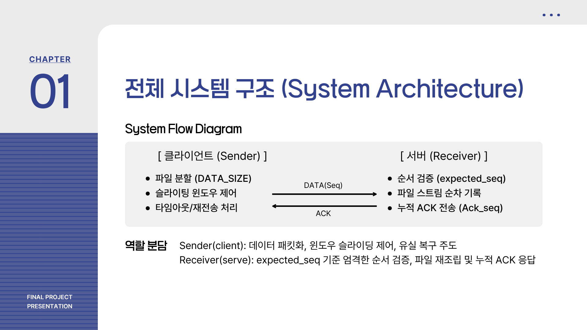
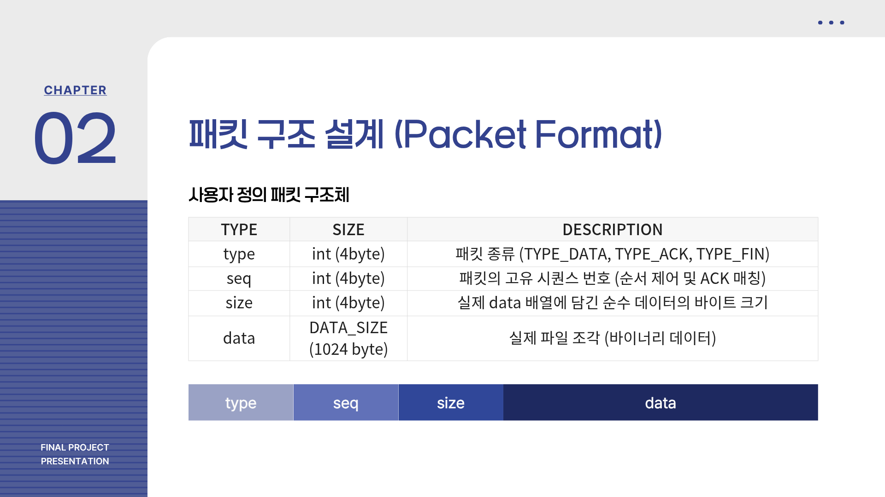
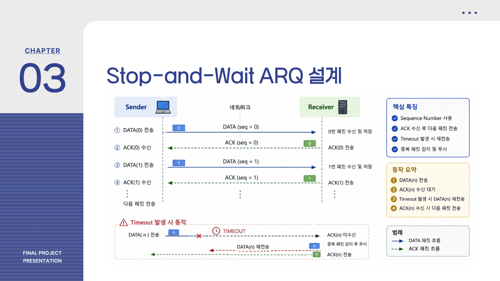
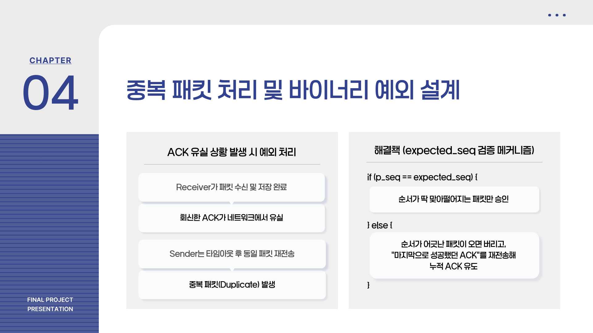
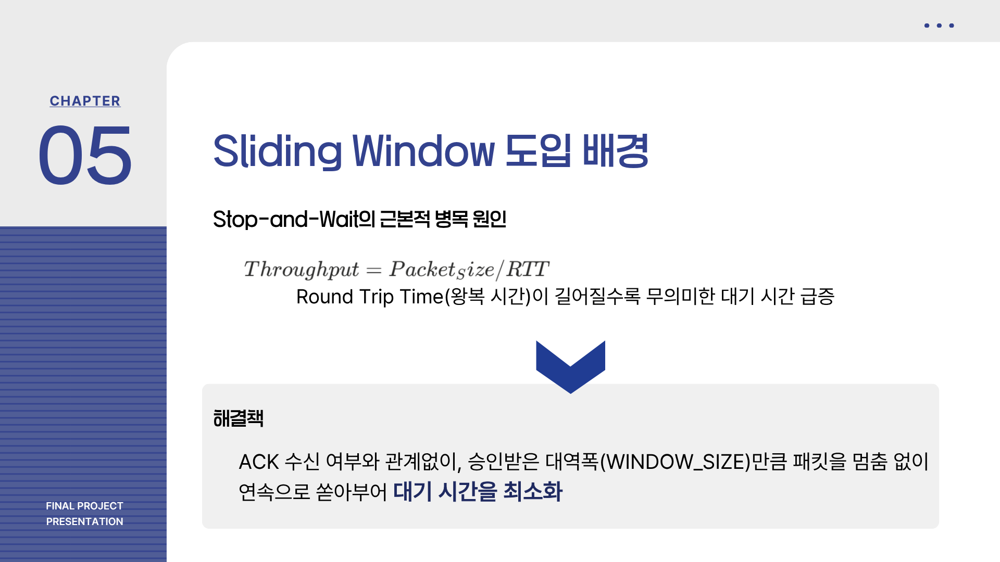
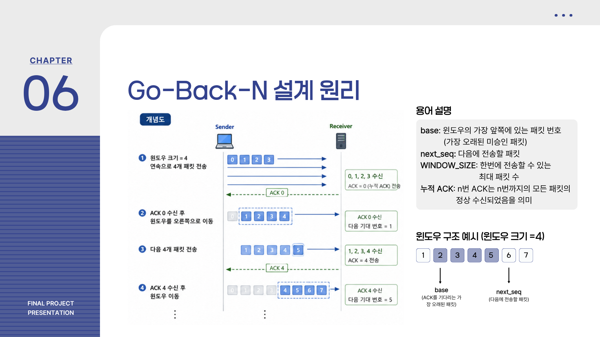
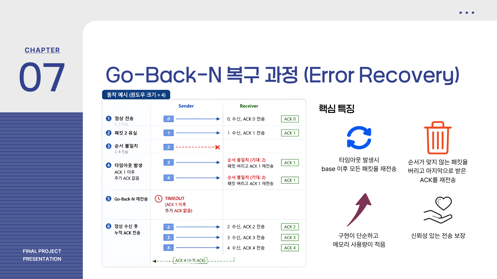

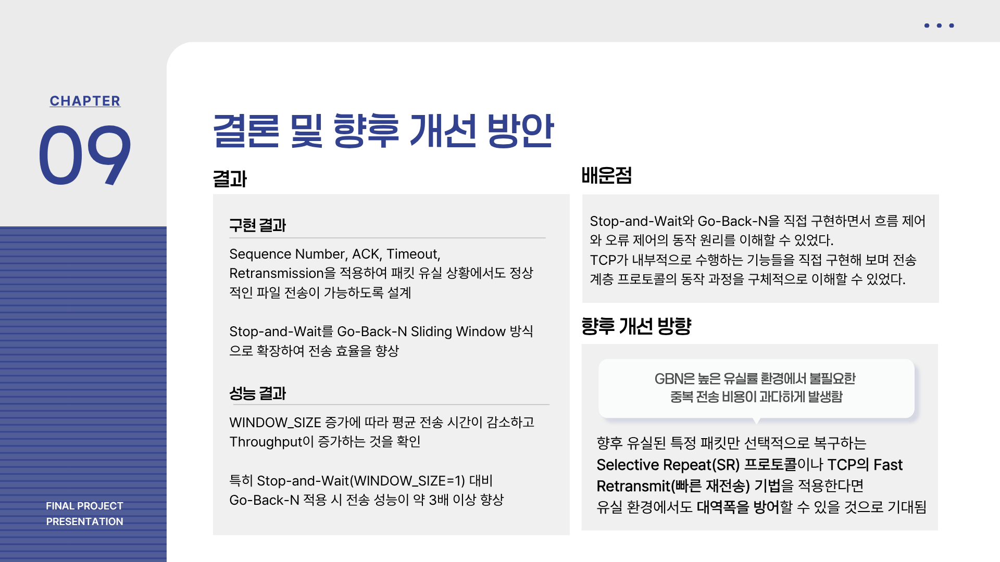


</details>
